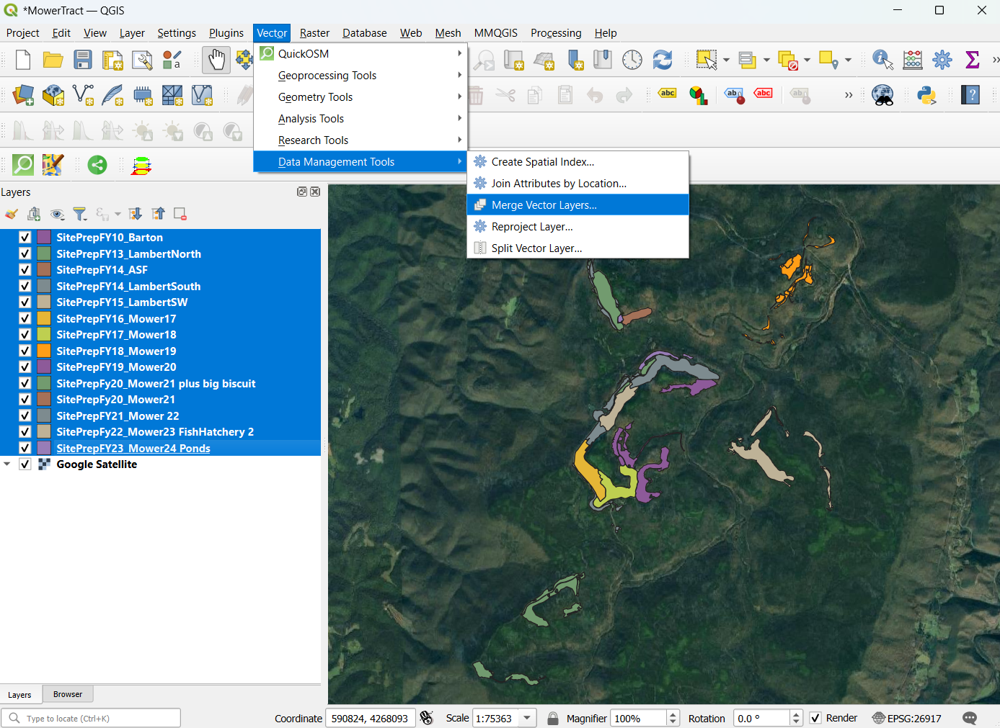

# Mower Tract Mined Land Restoration, WV

Ecological restoration of the Mower Tract mined lands in the Monongahela National Forest, WV.

*Across the README.md file, please answer the who, what, when, where, why, and how of the map making process*

## Project Contents

*If you wanted to include a table of contents to sections, and then links to each section.*

- [Data Source](#data-source)
- [Project Background](#project-background)
- [Purpose](#purpose)
- [Mapmaking Process](#mapmaking-process)
    - [Mapbox Starter Style](#mapbox-starter-style)
    - [Upload Data to QGIS](#upload-data-to-qgis)
    - [Merge Layers and Organize Attribute Table](#merge-layers-and-organize-attribute-table)
- [Map summary](#map-summary)

***

### Data Source

[Link to data source](https://...)

* Initial Data projection: 
* Final Map projection:

### Project Background

*If you are interested in [other Markdown formatting options](https://www.markdownguide.org/basic-syntax/)*

### Purpose
*Please write about the map purpose using complete sentences.*

Starting in 2010, the U.S. Forest Service Monongahela National Forest (MNF) began a partnership with Green Forests Work (GFW), a nonprofit housed in The University of Kentucky's Forestry Department, and a host of partners to conduct a suite of restoration activities, including non-native species removal, soil decompaction, organic matter loading, mined land reforestation, and wetland creation. In the short term, the goal is to create an early successional habitat, with the ultimate goal being to establish a red spruce dominant forest. Ancillary benefits include improved water quality, enhanced wildlife habitat, and improved ecosystem services, such as carbon sequestration. To date, nearly 900,000 seedling have been planted on almost 1,500 acres at the Mower Tract on Cheat Mountain in the MNF.

This map was created to showcase the mined land restoration work completed from 2010 through the end of 2024, and to layout some of the plans for future work.

### Mapmaking Process

*Example of in process map *

*You can describe the mapmaking process in this section, including images where it helps to describe the process.*

*You can also use some lists, and here's some formatting ideas.*

1. **Example bold**
2. *Example italics*
3. 
4. 

#### Mapbox Starter Style

Step 1. Instead of reinventing the wheel, I began this project with a good-looking but somewhat broken wheel in need of polishing- the Mapbox custom style I created for the assignment in MAP 671 Module 3. In that assignment, with instructor-provided color styles and plenty of written guidance, I created a custom map style that is pleasing to me and that I can repurpose for future map-making. This style is useful as an all-purpose starter map for me because it has many features typical of maps that I create often for my work. 

*Anna's custom map style Mapbox map. Downtown Pittsburgh was the focal center for the assignment map, but the map can be zoomed all the way out to see the continents.*

As stated on my custom style html page,   
>My custom style differentiates land types and shows terrain through hillshading. In the main frame, labels are assigned to rivers, and as you zoom out other names and boundaries appear, such as county names, state abbreviations, ocean names, and country names... The bluegreen-pattern and graze-pattern color styles give the map an old world look and were provided by the insructor. This style would be helpful for most maps in which zooming out to larger areas would be valuable to the viewers.

#### Upload Data to QGIS

I knew that I needed to do some manipulation of my data before adding it to my Mapbox style, so I added the shapefiles to QGIS. The 14 layers represent 14 mined land restoration areas "completed" over 14 years. I say "completed" because we are always going back into these restoration areas to do enhancement work.

*Adding shapefiles to QGIS.*

#### Merge Layers and Organize Attribute Table

Merge vector data from 14 layers into one layer and clean up attribute table. To do this, I navigated to the Merge Vector Layer tool by selecting Vector > Data Management Tools from the top menu bar. A temporary file was created, which I exported to a GeoJSON file and named. Because the attribute tables of the 14 layers were created over many years and some contained fields unique to just one layer, leaving a large number of null cells, combined attribute table columns needed to be cleaned up manually and organized.

*Merging vector layers.*

#### 

### Map summary

What are the key findings to take from your map and the overall mapmaking process?

## Final Project Link

Here you are linking from the README.md to the index.html.

Please view the [final map online](www.github...)
