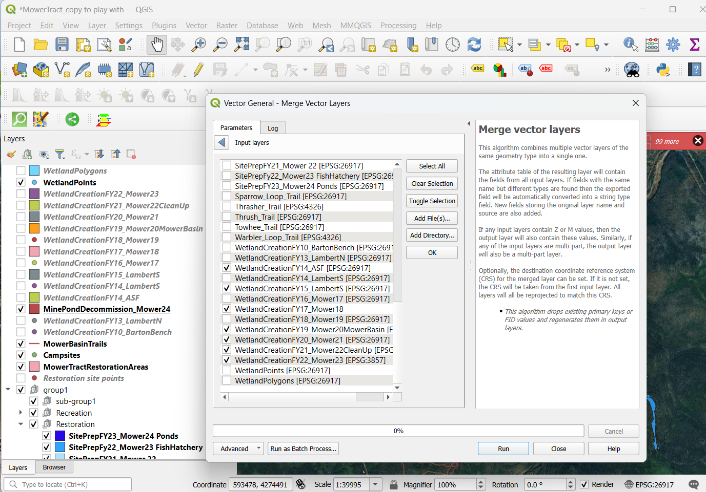

# Mower Tract Mined Land Restoration, WV

Ecological restoration of reclaimed mined lands on Cheat Mountain, in Randolph and Pocahontas Counties, West Virginia. The Mower Tract mined lands are in the Monongahela National Forest.

## Project Contents

- [Data Source](#data-source)
- [Project Background](#project-background)
- [Purpose](#purpose)
- [Mapmaking Process](#mapmaking-process)
    - [Mapbox Style](#mapbox-style)
    - [Upload Data to QGIS](#upload-data-to-qgis)
    - [Merge Layers](#merge-layers)
    - [Add Layers to Mapbox](Add-Layers-to-Mapbox)
        - [Customize styles](Customize-styles)
        - [Add Labels](Add-Labels) 
- [Map summary](#map-summary)

***

### Data Source

* Initial Data projection in ArcPro: NAD 1983 UTM Zone 17N / Transverse Mercator / 26917
* QGIS projection: NAD83 / UTM zone 17N EPSG:26917
* Final Mapbox map projection: Not sure where to find this information in Mapbox. WGS84 maybe

Mapbox Style: Classic Mapbox Satellite

The data used to create the map, shapefiles of the restoration areas, trails, dispersed campsites, and wetlands, have been created over the years primarily by U.S. Forest Service Monongahela National Forest partners, and sometimes Green Forests Work partners. These data are not available online.

In QGIS, Google Satellite XYZ tiles were used as a background for my process graphics.

### Project Background

Starting in 2010, the U.S. Forest Service Monongahela National Forest (MNF) began a partnership with Green Forests Work (GFW), a nonprofit housed in The University of Kentucky's Forestry Department, and a host of partners to conduct a suite of restoration activities, including non-native species removal, soil decompaction, organic matter loading, wetland creation, and reforestation on reclaimed surface coal mines. In the short term, the goal is to create an early successional habitat, with the ultimate goal being to establish a red spruce dominant forest. Ancillary benefits include improved water quality, enhanced wildlife habitat, and improved ecosystem services, such as carbon sequestration. To date, nearly 900,000 seedling have been planted on almost 1,500 acres at the Mower Tract on Cheat Mountain in the MNF.

### Purpose

This map was created to showcase the mined land restoration work completed from 2010 through the end of 2024, and to layout some of the plans for future work. I plan to continue improving and adding to this map to use as part of a case study that we plan to publish about this restoration project. Perhaps I will transition to a Web Map through the QGIS plugin so that I can include clickable information popups. 

### Mapmaking Process

#### Mapbox Style

I chose the Classic Mapbox Satellite style and made minimal customizations due to the amount of time spent troubleshooting, cleaning up, and styling my data.

#### Upload Data to QGIS

I needed to do some manipulation of my data before adding it to my Mapbox style, so I added the shapefiles to QGIS. The 14 layers represent 14 mined land restoration areas "completed" over 14 years. I say "completed" because we are always going back into these restoration areas to do enhancement work.

*Adding shapefiles to QGIS.*

I also added data to QGIS for restoration area name points, dispersed campsites, trails, and wetlands. 

#### Merge Layers

I merged vector data from 14 layers into one layer and cleaned up the attribute table. To do this, I navigated to the Merge Vector Layer tool by selecting Vector > Data Management Tools from the top menu bar. A temporary file was created, which I exported to a shapefile. Because the attribute tables of the 14 layers were created over many years and some contained fields unique to just one layer, leaving a large number of null cells, combined attribute table columns needed to be cleaned up manually and organized.

*Merging many restoration area layers into one.*

I also merged data for the dispersed campsites, trails, and wetlands. I had a great deal of trouble trying to merge my wetland polygon layers due to conflicting projections. The issue was solved by selecting all the polygons, exporting, and saving as a GeoJSON file.

*Merging many wetland layers into one.*

#### Add Layers to Mapbox
##### Customize Styles
##### Add Labels

One by one, I added the merged and cleaned up restoration areas, dispersed campsites, trails, wetlands, and restoration area names point data to Mapbox. I manipulated the colors, sizes, opacities, and changed these at various zoom levels. I changed the restoration area names points type to a symbol and added the names. I duplicated the trails and the campsites layers and made the copies symbol/text to add labels; each trail with a unique name was labelled and the dispersed campsite were labelled with their assigned numbers. I changed the colors of each of the trails and their names. 

*Styling the trails layers.*

#### Workarounds

##### Add a Legend

Because it was time prohibitive to make a legend in Mapbox at my skill level, I did a workaround in Microsoft powerpoint.

##### Add a time-lapse graphic of the retortaion work

I wanted a moving graphic to show the change in the restoration work's footprint over time. My workaround for this was to add map images, legend items, and the year to a powerpoint presentation and then make a zoom video clicking through it. I found code to make it start automatically or loop, but had no luck getting that to work.

#### Add Images

It seems there is endless opportunity with the restoration area images I could add to my webpage, and over time I will do just that.

#### Future work

I attempted to make a QGIS to Web leaflet and my attempt worked. However, the amount of time left to work on this project was not going to be enough to complete the work needed to refine all the attribute tables of all my data to make the map exactly what I envision. This is something that I can and will experiment with in the near future, and would be a huge asset to a case study about this restoration project.

I have many more things that I'd like to add to this map, things that may be better suited for a QGIS to Web map, such as links to research done by about 8 graduate students, and GFW reports. Maybe there is even a way to finally show my many before and after photos spatially. Lots more work to do. 

### Map summary

**Key findings of my map:**

1. There are many ways to tell the story of our complex ecological restoration project, and we have tried a number of those ways over the 15 years of this work. Bringing groups for in-person tours is an exceptional way to showcase the work, but there are many obvious limitations. An interactive map that can capture all the work done in each restoration area over the years far exceeds a flat map pdf like the ones I've been making for our annual reports.
2. Having the opportunity to view the work spatially on an interactive map solves many of my past problems, especially the problem of how to add to the story of areas that were already "completed" when we go back in to add habitat enhancements years later. That can now all be shown in my Mapbox map without being too overwhelming.
3. This map is a work in progress, one that I will continue to add to and improve over time, and as the restoration work continues. I am pleased with what I have learned in this course, and especially the fact that I was able to create this map.

## Final Project Link

Please view my [final map online](https://AnnaMB64.github.io/MowerTract-WV-restoration/index.html)
